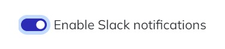

# Slack notifications

Code Cube notifications can be sent through various methods, including Slack integration. This feature is beneficial as it allows you to receive real-time updates about your Tag Monitor or DataLayer Guard setup directly in your Slack channel. The following steps will guide you in linking your Code Cube configuration to your Slack account.

You can use the same steps to configure Slack notifications for both the **Tag Monitor** and the **DataLayer Guard**. If you want to enable it for both products, please ensure to perform the steps below separately, on each product's configuration page.

### **Steps to Follow**

1. Open the configuration page on the portal ([Tag Monitor](https://portal.code-cube.io/tag_monitor_config) or [DataLayer Guard](https://portal.code-cube.io/datalayer_guard_config)).
2. Enable Slack notifications using the switch at the top of the configuration page, under the 'Slack notifications' subpage.
        
3. Fill in the two empty fields with your account details.
    - Insert your workspace ID (for example: [codecube.slack.com](http://codecube.slack.com/)).
        
    
        
    - Specify the name of the Slack channel where you want to receive notifications.
    *Note: Many users prefer to receive Slack notifications in a separate channel. If this is the case for you, make sure to create this channel in your Slack environment first.*
4. Click the bar below to authenticate the Code Cube app within your workspace. You'll be prompted to log into your workspace and authorize the Code Cube app.
5. After granting authorization, open your Slack. Now, invite the app to the desired channel where you want to receive notifications.
    - Open the specific channel in Slack and click on the channel name.

        
        
    - Navigate to the integrations tab and select 'Add apps'.
    - In the search bar, look for 'Tag Error Monitoring' or 'DataLayer Guard' and select 'Add'.
