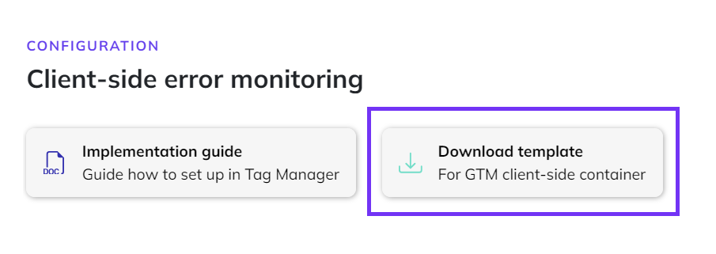
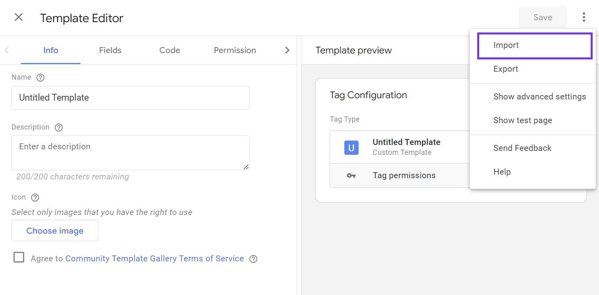
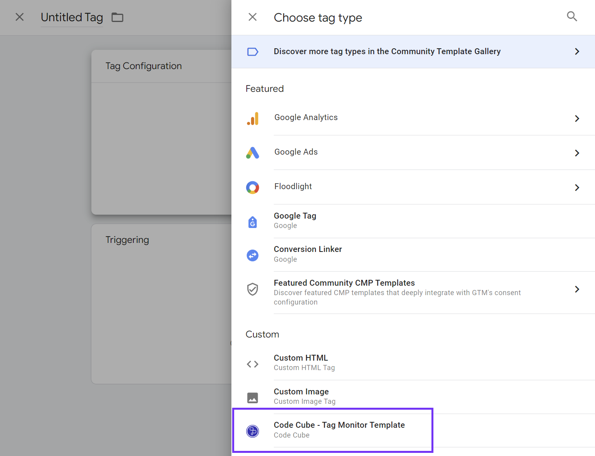
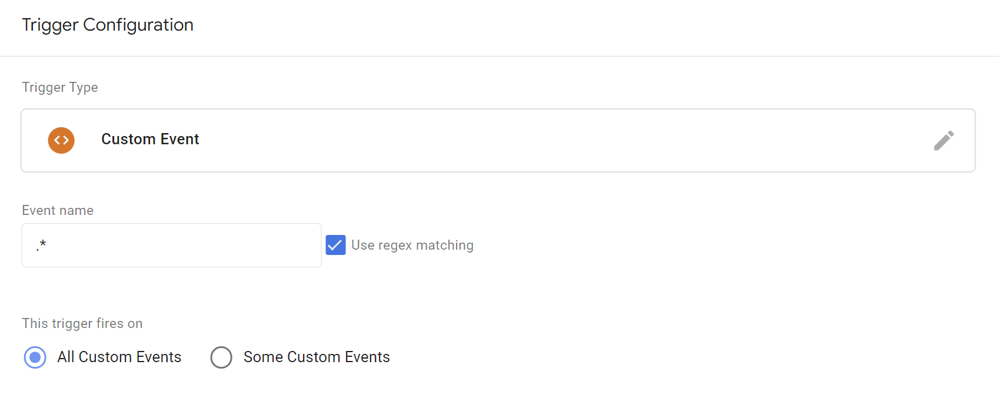
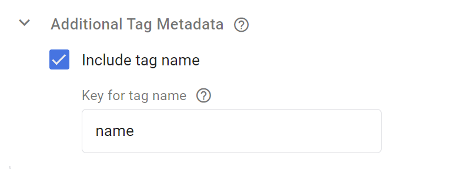
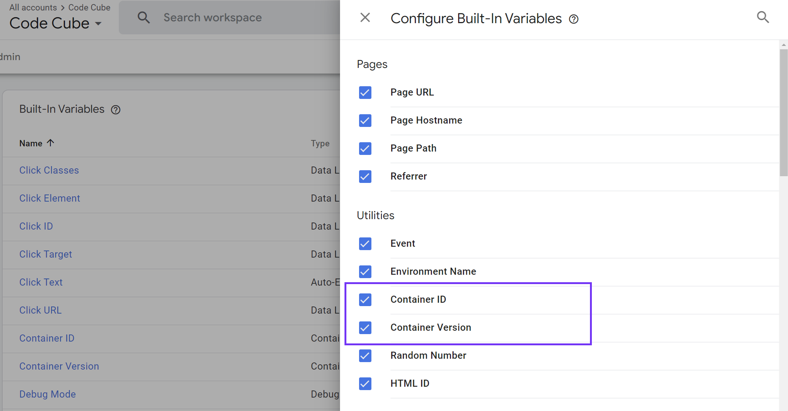

# Google Tag Manager Client-Side: Configuring Tag Monitor

This guide will walk you through the steps to set up the Tag Monitor for your Google Tag Manager client-side container. Make sure to finalize the configuration on step **product settings** on the Tag Monitor [configuration page](https://portal.code-cube.io/tag_monitor_config) first, before starting on these steps.

A couple of steps are required, which will all be discussed below.

1. Import Code Cube template in Google Tag Manager
2. Configure Code Cube's Tag Monitor tag
3. Add trigger to monitor the right set of events
4. Include metadata 'tag name' to all other tags in the container

## Import Code Cube template in Google Tag Manager

**Download Tag Monitor template from Code Cube portal** 

Download Code Cube's Tag Monitor template via the Tag Monitor [configuration page](https://portal.code-cube.io/tag_monitor_config), to be found in the step 'Client-side monitoring'.

_A seperate template is available for premium, enterprise and agency clients. Please get in contact with support@code-cube.io for more information._

**Add template to Google Tag Manager container** 

Open your Google Tag Manager client-side container. Navigate to "Templates", click in the "Tag Templates" section on the button "New".

**Import the Tag Monitor template**

Import the template you've just downloaded from the portal via 'Import' to be found via the three dots in the top right corner. You can save the template directly, no adjustments to the template are required.

_We did send in a request to have the template added to the [Community Template Gallery](https://tagmanager.google.com/gallery/#/?page=1), we will update the documentation as soon as the template is available here._

## Configure the Tag Monitor tag

Create a new tag in your container. Choose as tag type the Tag Monitor, which you've just imported in the previous step.

Within this tag, there are a couple settings to configure.

**Database Name**

Every client data is stored in it's own personal dataset. The value for your configuration can be found on the [configuration page](https://portal.code-cube.io/tag_monitor_config), in the step 'Client-side monitoring'.

**Add Metadata**

It is important that we exclude the Tag Monitor tag from monitoring. Therefore we need to set the following key / parameter via "Additional Tag Meta":

     Key: `exclude`
     Parameter: `true`

**Consent**: 

Set to 'No additional consent required'.  

See example of tag including all settings in image below.

 

## Add trigger to monitor the right set of events

The Tag Monitor should fire on **all events**, therefore we create a Custom Event trigger with the following settings:

    Event name: .*

    enable "use regex matching"

_Of course, you can customize the trigger following your own insights and requirements. This is our recommended set-up to monitor the all types of events in your container._

**Create segment**

Adviced is to monitor only a certain segment of all events. Make sure the segment is big enough to output significantly results, but on the other hand minimize the impact on site performance. 

The segment will be created based on the built-in variable **random number**:

- Enable the built-in variable "Random Number" via "Configure" under Built-in Variables.
- Decide on the to monitor segment (it is adviced to start in most cased with 20%), use the table below as a reference.
- Add the rule to the trigger via 'Some custom events'.

The maximum value of the random number is **2.147.483.647**. 

To monitor a segment, you can take a percentage of this total number and fire the tag when the random number gives a value equal to or less then this given value. The value below can be taken as a reference.

|  |  |   |   |
| -------------- | -------------- | --------- | -- | 
| segment of 0.5% | random number    | ends on   | 10.737.418
| segment of 5% | random number    | ends on   | 107.374.182
| segment of 10% | random number    | ends on   | 1*  
| segment of 20% | random number    | less then or equal to  | 429.496.729
| segment of 25% | random number    | less then or equal to  | 536.870.911
| segment of 50% | random number    | less then or equal to  | 1.073.741.823

*exception as there is a 1/10 change the number ends on a number between 0 and 9.

## Include metadata 'tag name' to all other tags in the container

**Update 'tag name' meta data in all tags**

For each tag, expand "Advanced Settings" and check the "Include tag name" checkbox under "Additional Tag Metadata". Set the key name to "name" as well.

_documentation to be added on bulk editting of tags_

## Enable build-in variables Container ID and Container version
Make sure to have the built-in variables **Container ID** and **Container version** enabled in your container. If these are not available yet in your variable overview, you can enable them via "Configure" under Built-in Variables.

## Go live with monitoring in Google Tag Manager
Publish the workspace in Google Tag Manager to your production environment. Verify if the implementation was succesfull by opening the [dashboard](https://portal.code-cube.io/tag_monitor_dashboard) in the Code Cube portal and see if data comes in.
