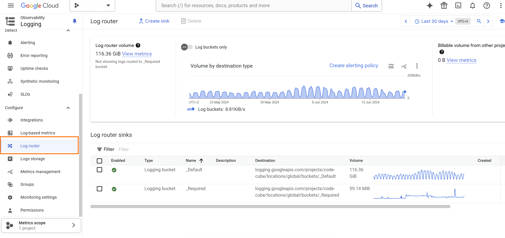
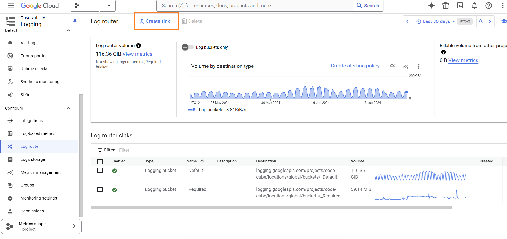
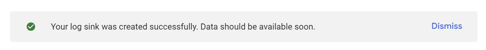

# Monitoring server-side GTM logs

❕This feature is only available with the Tag Monitor's premium and enterprise licenses.

Logs play a essential role in monitoring your server-side tagging. They assist in troubleshooting request issues, identifying missing data, and understanding how a vendor processed a request.

Logs are available for all tags that support the "logging to console" option in the server-side GTM container. However, it's important to note that you **can not** retrieve log data for Google Analytics and Google Ads tags, as these default templates do not support the logging option.

The logging will be configured in the Google Cloud Project where your GTM server-side container operates in a Cloud Run instance. From this instance, you can connect the logs to the Code Cube environment. These logs will then be paired with other error information and integrated into dashboarding and notifications.

We'll cover the following steps:

1. **Configure Logging Sink**: Establish a logging sink in the Google Cloud Platform project where server-side Tag Management is enabled via a Cloud Run instance.
2. **Grant Access**: Ensure that the Code Cube project has access to this sink and its logs.

## **Set-up of logging in your Google Cloud Project Setup**

### Navigate to “Create Sink”

1. Open the Google Cloud Platform project with the server-side tagging Cloud Run service enabled.
2. Go to the [Log Router](https://console.cloud.google.com/logs/router) in the Google Cloud Platform, located under the Logging page.
    
    
    
3. On this page, click the 'Create sink' option at the top.    
    

### Create logs routing sink

1. Add **sink details**
    - **Sink name**:  ‘codecube-serverside-logs’
    - **Sink description:** Add an optional description for the sink
        
        

        
2. Add **sink destination**
    - **Select sink service:** Choose ‘Other resource’
    - **Sink destination:** `bigquery.googleapis.com/projects/code-cube/datasets/{{dataset}}`
        - Find your {{dataset}} value on the configuration page in the portal.
            
        
            
3. **Choose logs to include in sink**
    - Enter the following query in the log filters section:
    `logName=~"stdout" AND textPayload!~"https://www.googletagmanager.com/sgtm/a" AND textPayload!~"Listening"`
    
    Explanation:
    
    - `logName=~"stdout"`: Filter logs based on stdout.
    - `textPayload!~"https://www.googletagmanager.com/sgtm/a"`: Exclude GTM analytics pings.
    - `textPayload!~"Listening"`: Excludes instance initializations.
    
Note: You can refine with more filters. Test them in the logs explorer before applying to avoid disrupting log writing.

 
    
5. Choose logs to filter out of sink 
    - This step is optional. Click 'Create sink' to skip.
   
After clicking 'Create sink', you'll be redirected to a page with a succes message at the top.

   

## **Manage Access to the sink**

When creating a logging sink in your Google Cloud Platform, a **service account** is automatically created. Find this service account through IAM and share the name with Code Cube at support@code-cube.io.

**Steps to find the service account:**

1. Navigate to IAM and admin → [IAM](https://console.cloud.google.com/iam-admin/iam).
2. Activate Google-provided role grants at the top right of the page.
    
    
    
 3. Search for the service account ending with logging.iam.gserviceaccount.com.
 4. Copy and share the name of this service account with support@code-cube.io. This account will be granted write permissions on the relevant dataset.
