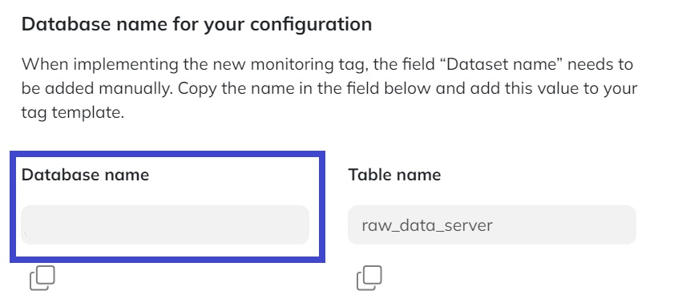

# Enable additional server-side error logs

<div class="alert alert-info" role="alert">❕This feature is exclusively accessible with the Tag Monitor's premium and enterprise licenses.</div>

## Introduction

To enhance *error tracking* of your server-side Google Tag Manager, enabling logging configurations in your Cloud environment is crucial. This document provides a implementation guide for setting up the Logging Sink on how to transfer data to Code Cube's environment. 

The logs will be received in Code Cube's cloud project and pipeline and from there matched with other error information and integrated in dashboarding and notifications.

The following steps will be explained:

1. Configure Logging Sink: Set up a logging sink in your Google Cloud Platform project where server-side Tag Management is enabled.
2. Grant Access: Ensure Code Cube's project has access to this sink and its logs.

## Log Router Setup
1. **Navigate to Log Router**

- Open the Google Cloud Platform project where the server-side tagging Cloud Run service is enabled.
- Via the navigation, go to the Log router page, found under Logging → Log router.


2. **Create Sink** and fill in the required details:


- Give the sink an appropriate name, for example 'code-cube-error-logs'.
- Additionaly give the sink an explainatory description.

3. Configure the destination as a BigQuery dataset and select **'Use a BigQuery dataset in another project'**.


4. **Enter Destination**: Paste the Sink destination provided below into the designated field:

```
bigquery.googleapis.com/projects/code-cube/datasets/{{dataset}}
 ```

**{{dataset}}**: The name of your dataset can be found in the Portal, on the [Tag Monitor configuration page](https://portal.code-cube.io/tag_monitor_config).




5. **Set Log Filters**: Input the following query in the log filters section:

    ```
    logName=~"stdout"
    AND textPayload!~"https://www.googletagmanager.com/sgtm/a"
    AND textPayload!~"Listening"
    ```

    - Explanation:
      - `logName=~"stdout"`: Filter logs based on stdout.
      - `textPayload!~"https://www.googletagmanager.com/sgtm/a"`: Exclude GTM analytics pings.
      - `textPayload!~"Listening"`: Exclude instance initializations.
         
__Note: Additional filters can be added for refinement, but test them in the logs explorer before applying to avoid disruptions in log writing.__

## Manage access to the Sink

1. **Identify Service Account**: The creation of a logging sink automatically generates a new service account in your GCP project.
2. **Share Service Account**: Locate this service account and share its name with your contact at Code Cube.

To find the service account:

1. Navigate to IAM and admin → IAM.
2. Enable Google-provided role grants on the top right of the page.
3. Look for the service account ending with `-logging.iam.gserviceaccount.com`.
4. Copy the name of this service account, which will be granted writing permissions on the relevant dataset and share the service account with your contact at Code Cube.
